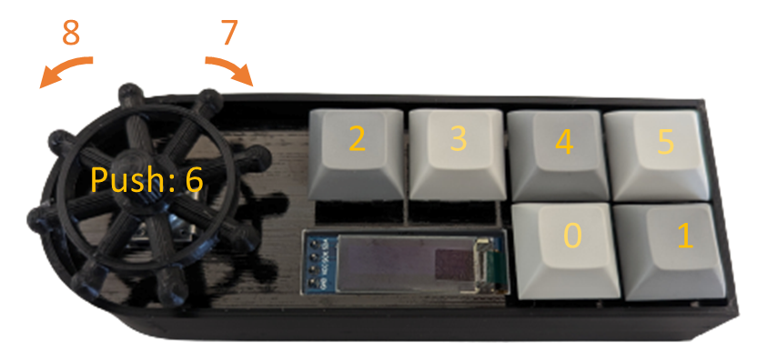

# Voyager Pad
A CircuitPython based macropad featuring xiao rp2040.

## Guides
- [How to configure the device to use different macros](./guides/configure.md)
- [Example use cases](https://github.com/urfdvw/voyager-pad/tree/main/example%20settings)
- [How to update the firmware of the device](https://github.com/urfdvw/voyager-pad/releases)

## Dependencies
- CircuitPython7.3.3
- adafruit_display_text
- adafruit_hid
- adafruit_displayio_ssd1306.mpy
- adafruit_framebuf.mpy