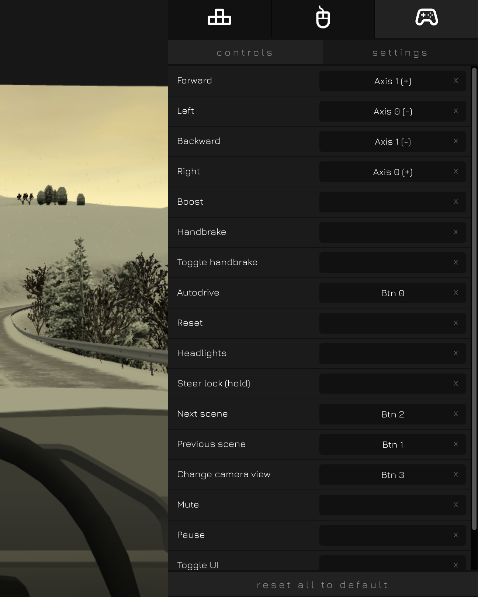

*Please backup your current settings.json before trying this example*

replace the 'settings.json' in 'CIRCUITPY' drive with the one in this folder to try out.

# Driving Game
This is an example of Gamepad.

## Layers
Layer -1
- button 2~5 are different amount of y-axis.
- rotate encoder to change the amount of x-axis.
- push the encoder to recenter x-axis
- all names are empty, this is to disable any screen display and thus minimum the delays.

Layer 0
- button 2~5 are gamepad buttons A,B,X,Y

other buttons or layers are not enabled

##  Use cases
Test the gampad settings
- https://devicetests.com/controller-tester

Driving Game
- https://slowroads.io/
- Dafault layer
    - encoder is used as steering wheel
        - best experience in in-cab view, where the action of the wheel sync with the encode
    - button 5 is gas paddle
        - 4 is gentle gas paddle
    - button 2 is break
        - 3 is gentle break
- Layer 0 can be mapped to other function switches as you like
- suggested in game cotrol settings

